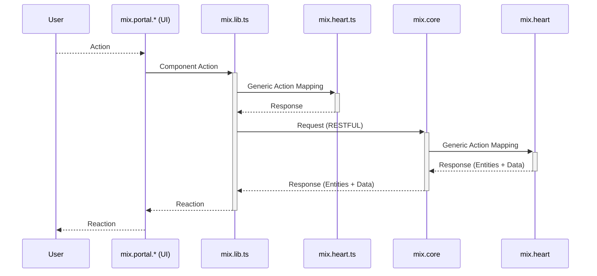

```mermaid
sequenceDiagram
    User-->>mix.portal.* (UI): Action
    mix.portal.* (UI)->>+mix.lib.ts: Component Action
    mix.lib.ts->>+mix.heart.ts: Generic Action Mapping
    mix.heart.ts-->>-mix.lib.ts: Response
    mix.lib.ts->>+mix.core: Request (RESTFUL)
    mix.core->>+mix.heart: Generic Action Mapping
    
    mix.heart-->>-mix.core: Response (Entities + Data)
    mix.core-->>-mix.lib.ts: Response (Entities + Data)
    mix.lib.ts-->>-mix.portal.* (UI): Reaction
    mix.portal.* (UI)-->>User: Reaction
```